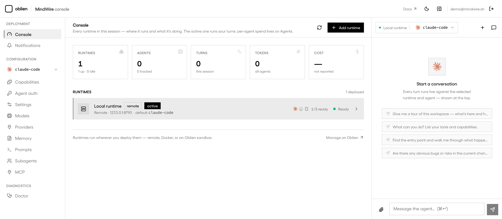

<div align="center">

# MindWire

**The runtime and control plane for AI harnesses.**

Claude Code, Codex, and opencode already plan, edit files, use tools, and complete multi-step work.
Mindwire lets your product run them without rebuilding an agent loop, tool runtime, streaming transport,
session system, or provider integration from scratch.

[](./LICENSE)
[](https://github.com/oblien/mindwire/actions/workflows/ci.yml)

[Docs](https://mindwire.sh/docs) · [Quickstart](https://mindwire.sh/docs/guides/quickstart) · [Architecture](https://mindwire.sh/docs/concepts/architecture)

</div>

Mindwire is an open-source, self-hostable runtime for coding-agent harnesses. It owns the agent process
and gives your product one API for turns, streaming, auth, sessions, tools, and runtime placement—while
the selected agent continues to run natively.

```ts
import { Mindwire } from "mindwire";

const mw = new Mindwire({ agent: "claude-code" });
const run = await mw.turn({
  chatId: "demo",
  message: "Add a /healthz endpoint and a test.",
});

for await (const event of run) {
  if (event.type === "text") process.stdout.write(event.text ?? "");
}
```

Change `agent` to use Codex or opencode. Use `remote()`, `ssh()`, `docker()`, or `oblien()` to run the
same integration where the work belongs.

## Included

- One typed API and reconnectable event stream across supported agents.
- Native agent auth, sessions, tools, MCP, memory, prompts, providers, and capability reporting.
- Local, remote, SSH, Docker, and microVM runtime targets.
- A self-hostable console for operating runtimes and agent work.

## Control plane included

The console gives production teams one place to manage multiple runtimes, inspect active work and spend,
configure each agent's native surfaces, and move execution between local machines, remote hosts, Docker,
and microVMs.

<p align="center">
  
</p>

## Supported agents

| Agent | ID | Status |
| --- | --- | --- |
| Claude Code | `claude-code` | Implemented |
| OpenAI Codex CLI | `codex` | Implemented |
| opencode | `opencode` | Implemented |
| Grok CLI | `grok` | Planned |
| GitHub Copilot CLI | `copilot` | Planned |

## Repository

```text
daemon/           Go runtime and agent adapters
packages/sdk/     TypeScript SDK
apps/web/         Marketing site and documentation
apps/console/     Self-hostable operations console
packages/docker/  Docker images and self-host Compose deployment
```

## Develop

```bash
bun install
bun dev
bun test

cd daemon && go test -race ./...
```

For deployment, architecture, API reference, and adapter capabilities, see [mindwire.sh/docs](https://mindwire.sh/docs).

## License

[Apache-2.0](./LICENSE)
